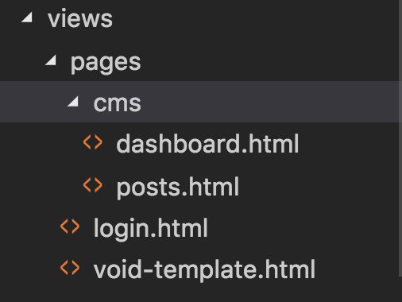

## FAQ

- 1) 如何运行？

  - 安装对应的依赖

    运行 `$ npm i`, 安装对应的依赖，生产模式下，运行 `$ npm i --production`，可避免安装一些开发时的组件，减少安装时间。

  - 自动化前端库文件的拷贝

    运行 `$ npm run gulp`，通过 gulp 将前端依赖的类库自动拷贝到相应的目录下。

  - 复制项目配置文件

    复制 `config.default.json` ，并重命名为 `config.json`；根据实际的需求修改一下配置。
    ```javascript
    {
      "server":{
          "port": 9007  // this is the port
      },
      "mysql":          // this is the db setting
      {
          "host": "localhost",
          "database": "fpm_project",
          "username": "root",
          "password": "root",
          "showSql": true
      },
      "mqttserver":       // this is the mqtt setting
      {
          "host": "mqtt.yunplus.io",
          "port": 1883,
          "username": "admin",
          "password": "123123123"
      }
    }
    ```

  - 运行

    运行 `$ npm run dev`， 即可运行系统。

  - 进入登录页面

    浏览器打开 [http://localhost:[YourPort]](http://localhost:9007)。即可进入系统


- 2) 如何找到程序代码的入口？

    本系统使用 `yf-fpm-server` 进行开发，框架代码详见: [https://github.com/team4yf/yf-fpm-server](https://github.com/team4yf/yf-fpm-server).

    程序入口文件 `source/app.js` -> [source/app.js](./source/app.js)。

    主要分为前后端两个部分；前端主要用于渲染各个页面，后端则负责对应的业务逻辑处理。

- 3) 如何创建一个新页面/功能？

    系统中通过 `menus.yml` 来定义系统菜单与对应的页面路径。

    ```yml
    menus:
    - invisible: true
      path: '/cms/login'
      page: 'pages/login.html'

    - invisible: true
      path: '/cms'
      page: 'pages/login.html'

    - invisible: true
      path: '/'
      page: 'pages/login.html'

    - type: '-'
      title: '控制台'

    - title: '仪表板'
      icon: 'dashboard'
      path: '/cms/dashboard'
      page: 'pages/cms/dashboard.html'

    - type: '-'
      title: '内容管理'

    - title: '文章'
      icon: 'edit'
      path: '/cms/posts'
      page: 'pages/cms/posts.html'

    - title: '标签'
      icon: 'tags'
      path: '/cms/tags'
      page: 'pages/cms/tags.html'

    - type: '-'
      title: '用户'

    - title: '用户列表'
      icon: 'users'
      path: '/cms/users'
      page: 'pages/cms/users.html'

    - type: '-'
      title: '系统'

    - title: '基础设置'
      icon: 'cogs'
      path: '/setting'
      page: 'pages/setting.html'
    ```

  其中对应的 `page` 就是页面代码的路径。

  

  页面使用 `nunjucks` 模版引擎，UI库是 `AdminLte`，可根据其手册进行页面的编码。

- 4) 如何实现前后端数据的交互?

    本系统是一个伪前后端分离的框架，为的是让更多从jQuery转向 SPA 的前端开发者能更快的做出产品。
    `fpmc-ng1` 是一个SDK，是负责前后端数据交互的；如下是一个示例：

    该 `示例1` 从数据库中的`usr_userinfo`数据表中取出 第一页的10条数据，且包含`id,nickname,username,email,mobile,gender,lastLoginIp` 这些字段，并计算满足条件的数据总数。

    ```javascript
    // 创建一个控制器模块，并导入 fpm.service 模块。
    angular.module('fpm.c.post', ['fpm.service', 'fpm.filter'])
    .controller('PostCtrl', ['$scope', '$ngFpmcService',
      function ($scope, $ngFpmcService) {
        // $ngFpmcService 提供了 Query, Func, Object 等
        const { Func, Query } = $ngFpmcService;
        new Query('usr_userinfo')
          .select('id,nickname,username,email,mobile,gender,lastLoginIp')
          .page(1,10)
          .findAndCount()
          .then(console.log)
          .catch(console.error)
      }])

      // output:
      {
        "errno": 0,
        "message": "",
        "starttime": 1540878793979,
        "data": {
          "count": 10,
          "rows": [{
            "id": 27,
            "nickname": "张恬伟 ",
            "username": "ztw",
            "email": "13584198834@163.com",
            "mobile": "13584198834 ",
            "gender": 1,
            "lastLoginIp": "127.0.0.1",
            "createAt": 1526370965088,
            "updateAt": 0
          }, {
            "id": 25,
            "nickname": "江  峰 ",
            "username": "jf",
            "email": "13812133386@163.com",
            "mobile": "13812133386 ",
            "gender": 1,
            "lastLoginIp": "127.0.0.1",
            "createAt": 1526370965088,
            "updateAt": 0
          }, {
            "id": 24,
            "nickname": "陆学武 ",
            "username": "lxw",
            "email": "18362358588@163.com ",
            "mobile": "15358068352",
            "gender": 1,
            "lastLoginIp": "127.0.0.1",
            "createAt": 1526370965088,
            "updateAt": 0
          }, {
            "id": 21,
            "nickname": "宋静文",
            "username": "sjw",
            "email": "18661052161@163.com ",
            "mobile": "15358069523",
            "gender": 0,
            "lastLoginIp": "127.0.0.1",
            "createAt": 1526370965088,
            "updateAt": 0
          }, {
            "id": 20,
            "nickname": "卫美玉",
            "username": "wmy",
            "email": "13621529058@163.com ",
            "mobile": "13621529058 ",
            "gender": 0,
            "lastLoginIp": "127.0.0.1",
            "createAt": 1526370965088,
            "updateAt": 0
          }, {
            "id": 17,
            "nickname": "朱寅浩",
            "username": "zyh",
            "email": "18626367704@163.com ",
            "mobile": "18626367704",
            "gender": 1,
            "lastLoginIp": "127.0.0.1",
            "createAt": 1526370965088,
            "updateAt": 0
          }, {
            "id": 16,
            "nickname": "陈曦",
            "username": "cx",
            "email": "13903351695@163.com ",
            "mobile": "13903351695 ",
            "gender": 1,
            "lastLoginIp": "127.0.0.1",
            "createAt": 1526370965088,
            "updateAt": 0
          }, {
            "id": 14,
            "nickname": "陈梦",
            "username": "cm",
            "email": "15251582013@163.com ",
            "mobile": "15251582013 ",
            "gender": 0,
            "lastLoginIp": "127.0.0.1",
            "createAt": 1526370965088,
            "updateAt": 0
          }, {
            "id": 6,
            "nickname": "夏英伟",
            "username": "xyw",
            "email": "betterxiayw@126.com",
            "mobile": "13942602228",
            "gender": 1,
            "lastLoginIp": "127.0.0.1",
            "createAt": 1526370965088,
            "updateAt": 0
          }, {
            "id": 3,
            "nickname": "admin",
            "username": "admin",
            "email": "zyh1985200@yahoo.com.cn",
            "mobile": "18626367704",
            "gender": 1,
            "lastLoginIp": "127.0.0.1",
            "createAt": 1526370965088,
            "updateAt": 0
          }]
        },
        "timestamp": 1540878794023
      }
    ```

    `示例2` 调用后端自定义的函数来交互数据。这里需要做2个部分的工作：
    1. 定义后端函数来处理参数，逻辑，并返回结果；在 `source/backend/index.js` 代码文件中的行3 添加如下代码：
    ```javascript
    biz.addSubModules('foo', {
      bar: args => {
        return 'Hi there,' + args.name;
      }
    });
    ```
    2. 前端定义函数来调用：
    ```javascript
    // 创建一个控制器模块，并导入 fpm.service 模块。
    angular.module('fpm.c.post', ['fpm.service', 'fpm.filter'])
    .controller('PostCtrl', ['$scope', '$ngFpmcService',
      function ($scope, $ngFpmcService) {
        //$ngFpmcService 提供了 Query, Func, Object 等
        const { Func, Query } = $ngFpmcService;
        new Func('foo.bar')
          .invoke({ name: 'ox'})
          .then(console.log)
          .catch(console.error);
      }])

    //output:
    {
      "errno": 0,
      "message": "",
      "starttime": 1540879463759,
      "data": "Hi there,ox",
      "timestamp": 1540879463760
    }
    ```

- 5) 如何使用 `sql generator`?

  `sql generator` 是一个用于快速生成建表语句的工具，通过`meta.json`文件生成sql语句。

  - 创建 meta.json

    在 `tool/meta/` 目录下创建一个 meta 文件，文件名为表名，如`foo.json`；
    ```javascript
    {
      "name": "foo",          // 表名
      "comment": "foo comment", // 表备注
      "fields": [
        {
          "name": "f_key",  // 字段定义
          "type": "string"  // name 和 type 是必须定义的。
        },
        {
          "name": "f_val",
          "dft": "aaa",     // 字段缺省值
          "nn": false,      // 字段不可为空
          "type": "string"  // 字段类型, 可选： string/text/longText/int/bool/bigint/timestamp
        }
      ]
    }
    ```

    可生成如下 sql 语句：
    ```sql
    DROP TABLE IF EXISTS `foo`;
    CREATE TABLE IF NOT EXISTS `foo` (
      `id` bigint(11) NOT NULL AUTO_INCREMENT COMMENT 'ID',
      `delflag` tinyint(4) NOT NULL DEFAULT '0' COMMENT '删除标示',
      `createAt` bigint(20) NOT NULL DEFAULT '0' COMMENT '数据创建时间戳',
      `updateAt` bigint(20) NOT NULL DEFAULT '0' COMMENT '数据更新时间戳',
      `f_key` varchar(200)  NULL  COMMENT '-',
      `f_val` varchar(200) NOT NULL DEFAULT 'aaa' COMMENT '-',
      PRIMARY KEY (`id`)
    ) ENGINE=InnoDB AUTO_INCREMENT=1 DEFAULT CHARSET=utf8 COMMENT='foo comment';
    ```

    可在 [phpmyadmin](http://localhost:88) 中执行该 sql 完成建表。

- 6) 如何在前端访问URL中的参数？

  通常我们第一时间会想到，通过正则表达式来截取URL中的参数，这样当然是可行的。

  本系统还提供了一个更简洁的办法来访问URL中的参数；`APP.query`， 如：
  ```javascript
  // http://localhost:9007/cms/post/create?data=1
  console.log(APP.query);
  // output:
  {
    data: "1"
  }

  // http://localhost:9007/cms/post/detail/1
  console.log(APP.params);
  // output:
  {
    id: "1"
  }
  ```

  *WARNNING* 需要注意的是，`params` 中的参数名是在 `koa-router` 中定义的 URL 中的参数名，比如上方的代码清单中的 `id` 是因为 router中的定义 `/cms/post/detail/:id` 。